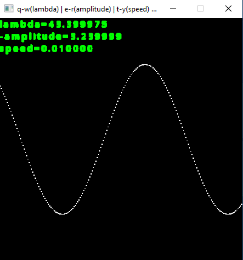

# sin-waves-CPP
<b>sinus waves with SFML</b>  
<i>*you can change lambda, amplitude and speed.</i>  

<b>CONTROLS:</b>  

q => increase lambda 
w => reduce lambda 
e => increase -amplitude 
r => reduce -amplitude 
t => increase speed 
y => reduce speed 
a => reload values 

 
 
 

<b>How does it look</b>  

